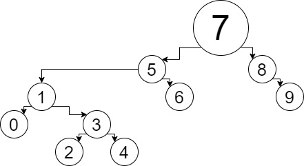

# BINARY SEARCH TREE


## [7, 5, 1, 8, 3, 6, 0, 9, 4, 2] dizisinin Binary-Search-Tree aşamalarını yazınız.

```
root 7 dir. 
5 soluna yazılır, 1, 5'in soluna yazılır.
8, 7'nin sağına yazılır.
3, 1'in sağına yazılır. 6, 5'in sağına yazılır.
0, 1'in soluna yazılır. 9, 8'in sağına yazılır.
4, 3'ün sağına yazılır. 2, 3'ün soluna yazılır.
```

